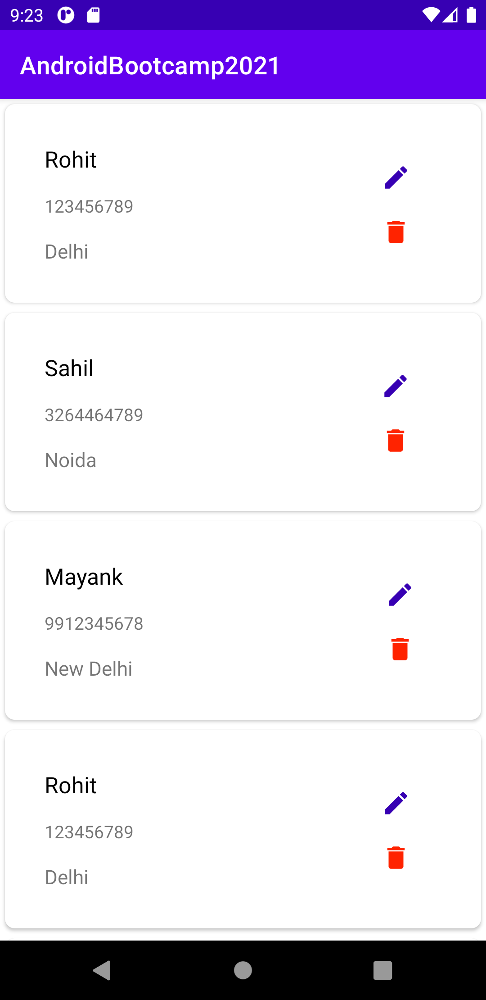
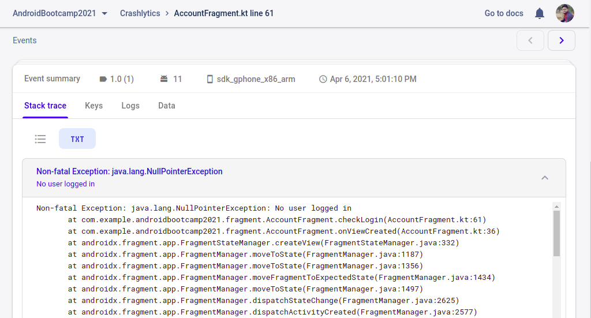

# Session : Firebase 1

### Exercise

* Add Crashlytics and Analytics on Navigation Component exercise.

1. Log events for Splash, Login, Home & Account Screen with customised events.
2. Log event for 'existing_user' or 'no_user' on the Splash screen.
3. Log event everytime only when a user updates description on Home Screen using the Dialog. (Shall not log event if the user do not updates the description value)
4. Use default property "user_id" if user name exits in SharedPref, otherwise clear default property.

5. On deeplinking to Account screen, if user name is not found in SharedPref, log crashlytics checked exception.

