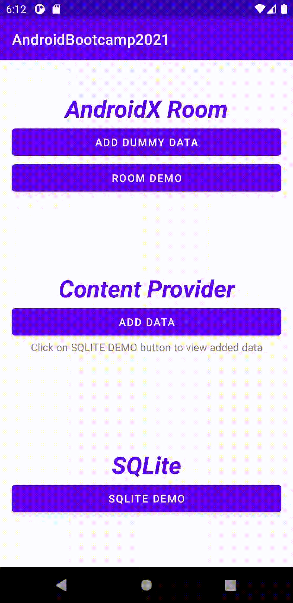

# Session : Android: Storage Part 2

### Main Screen

### Exercise

* Make an application with following features:
	1. Add Employee information like Name, Address, mobile number.
	2. Display all inserted record in RecyclerView and each item have edit and delete button.
	3. On delete button clicked - delete record from table and refresh list Data.
	4. On edit button clicked - update record in table and refresh list Data.

##### SQLite Demo (From Session : Android: Storage Part 1)

	
##### Room Demo	

#### Content Provider Demo
* Make an application using Content provider with following features:
	1. Add user information like Name, mobile number from the contacts list.
	2. Display all inserted record in RecyclerView and each item have edit and delete button..
	3. On delete button clicked - delete record from table and refresh list Data.
	4. On edit button clicked - update record in table and refresh list Data.

