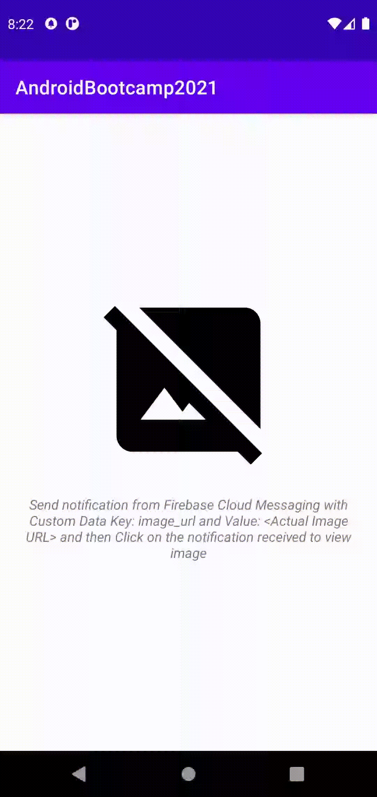

# Session : Firebase 2

### Exercise

* Create a push notification using firebase console with a text payload & image and distribute it using Firebase distribution.(Handle both foreground and background scenarios)
1. Foreground : Create a notification and display that data
2. Background : After clicking on the notification show that data on UI

Join testing group: [App Link](https://appdistribution.firebase.dev/i/b8b4b8241f64f0c9)

