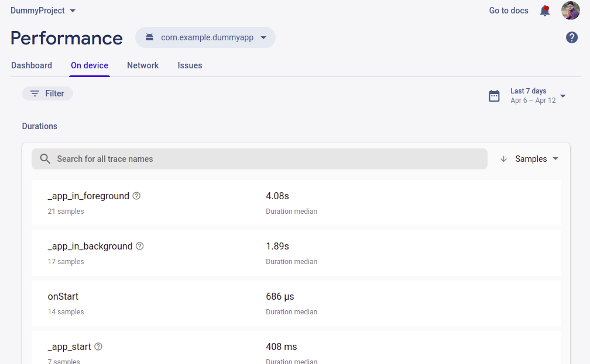

# Session : Background Task 1

### Main Screen

### Exercise

* Use start() join() and sleep() methods in single program to execute different threads.

* Register receiver  for incoming calls and battery status.

* Music Player with raw file to play song in background.

* Bind local service from activity. ( Get Current time )

