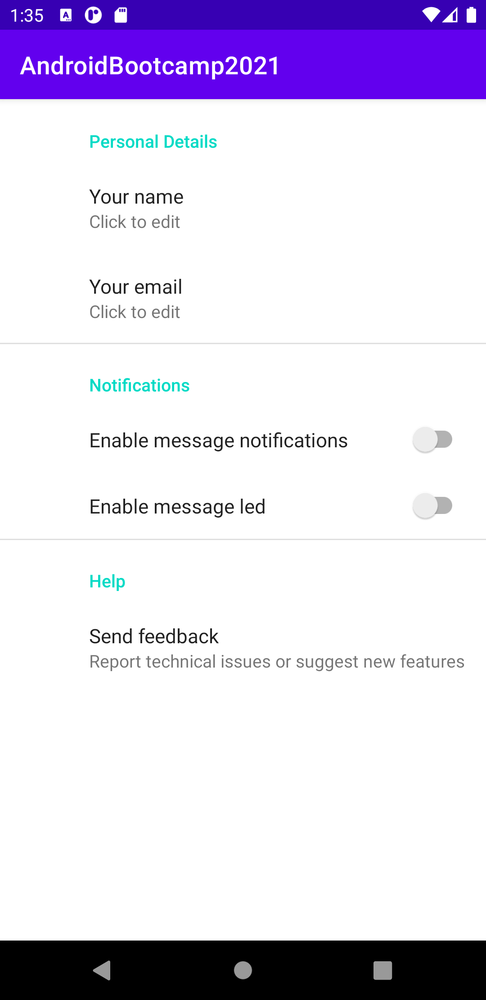

# Session : Android: Fragment Handling

### Exercise

* Observe Lifecycle of Fragment with activity
* Observe Lifecycle of Fragment with activity while using Add, Replace, hide, show, remove

* Dialog fragment, Preference Fragment

##### Dialog Fragment

##### Preference Fragment

* Develop a sample that show the UI like below 

