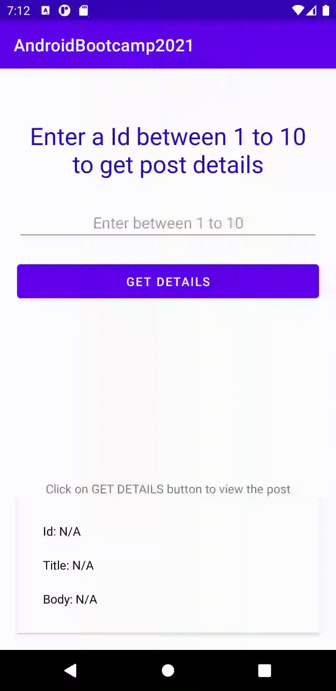

# Session : Webservices 1

### Exercise

* Create an app which uses @GET request to the server and fetch post from the server on the basis of postId (Between 1..10). 

_Base URL: https://jsonplaceholder.typicode.com/posts/{postId}_

